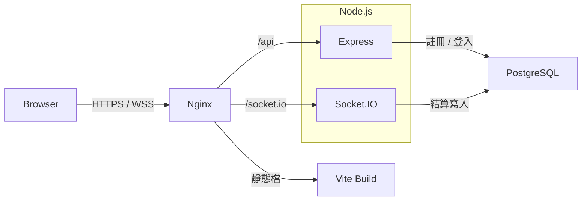
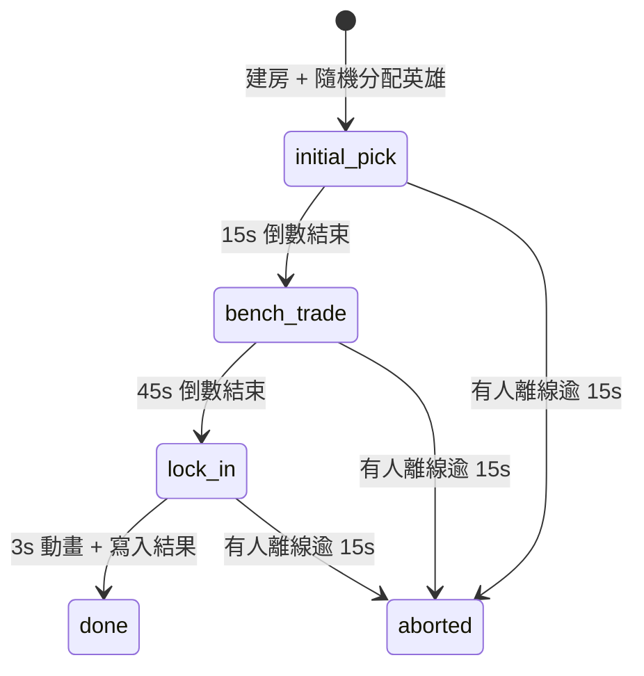

# Game Draft System

「配對 → 選角 → 板凳挑選 → 交換 → 鎖定」的即時多人選角系統。

Live Demo: [game-draft.zhijiehuang.com](https://game-draft.zhijiehuang.com)

<!-- ## Preview -->

<!-- 把 mp4 拖進 GitHub issue/PR 輸入框，複製產生的 user-attachments 網址，單獨貼在下面一行（不要包標籤或括號，GitHub 會自動渲染成播放器） -->

## Tech Stack

| 層級     | 技術                                  |
| -------- | ------------------------------------- |
| 語言     | TypeScript                            |
| 前端     | React · Vite · Zustand · Tailwind CSS |
| 後端     | Express · Socket\.IO                  |
| 資料庫   | PostgreSQL                            |
| 套件管理 | pnpm workspaces                       |
| 部署     | VPS · Nginx · PM2 · Cloudflare DNS    |

## Features

- 即時列隊等待，湊滿 4 人自動建房
- 倒數計時與階段切換由 server 驅動，前端無法修改遊戲狀態
- 三階段選角流程：初選 → 板凳挑選 / 1v1 交換 → 鎖定結算
- 交換申請具備 per-user 鎖定與 snapshot 驗證
- 斷線重連機制（15 秒 grace period），處理網路中斷場景；重整或登出則視為離開
- JWT httpOnly cookie 驗證，Socket\.IO 握手驗證

## Architecture



### 房間狀態機



### 設計決策

- **房間狀態全在記憶體**：房間生命週期約 60 秒、socket 事件高頻，僅結算時寫入 DB；未來可擴充為歷史記錄功能
- **條件渲染取代路由**：畫面狀態由 server 透過 socket 事件決定，玩家無法自行控制，URL 不承載狀態資訊
- **同源部署**：前後端統一 origin，不需處理 CORS，cookie 自動帶上

## Getting Started

### 前置需求

- fnm
- Docker

### 安裝與啟動

```bash
fnm install        # 讀 .nvmrc，安裝 Node 24
fnm use
corepack enable    # 啟用 corepack，自動使用 package.json 指定的 pnpm 版本
pnpm install

# 設定環境變數
cp .env.example .env

# 編輯 .env：POSTGRES_PASSWORD, DATABASE_URL, JWT_SECRET 等環境變數

# 啟動 PostgreSQL（docker compose 會讀 .env 內的 POSTGRES_* 變數）
docker compose up -d

# 建立資料庫 schema（套用 migrations，已套用的會自動跳過）
pnpm --filter @app/server migrate

# 選用：建立 4 個測試帳號（player1~player4，密碼 password），方便湊滿 4 人測試
pnpm --filter @app/server seed

# 啟動開發環境
pnpm dev
```

## Roadmap

- [ ] 自建房 + 邀請碼（DB schema 已預留欄位）
- [ ] 房內聊天室
- [ ] 歷史記錄 / 個人戰績頁
- [ ] OAuth 登入（Google / Discord）
- [ ] 完整測試覆蓋（unit + integration + e2e）
- [ ] Redis 支援多 instance 水平擴展
